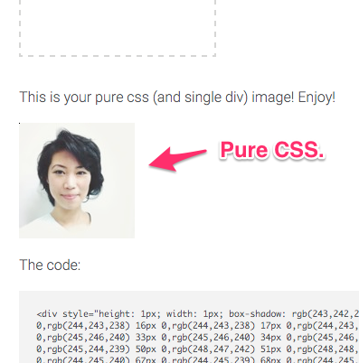

# img2css

This is a tool that can convert any image into a pure css image.

[Live demo](http://javier.xyz/img2css/)

## How does it works?

Well, it just puts the image in a canvas, calculates an array with the rgb values, and then... creates a single pixel shadow for each value!

## Why?
Hum... to demonstrate the power of CSS!

And this may have another interesting properties, like creating loading screens with pixel art.
